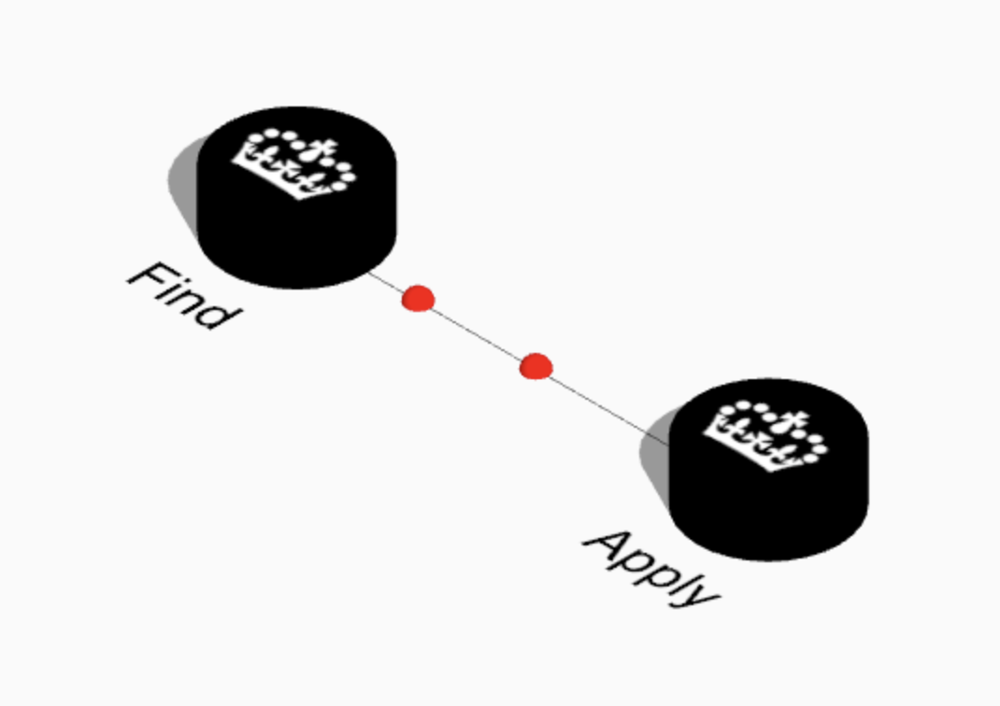
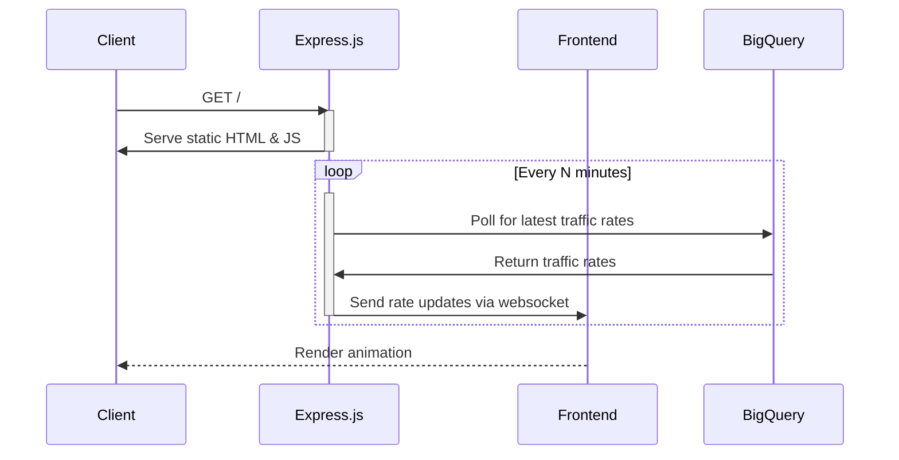

# ts-motion



An animation showing traffic passing between and amongst [Teacher Services
digital
services](https://tech-docs.teacherservices.cloud/#rails-apps-and-dependencies).

Work in progress.

## Architecture



## Running

```bash
npm install
npx ts-node --project tsconfig.server.json src/server/server.ts
```
